# Base de Datos — Retail de Telecomunicaciones
 
Modelo de datos en PostgreSQL para el análisis comercial de una cadena de retail de telecomunicaciones. Incluye el esquema, las vistas analíticas y las consultas de exploración que alimentan un modelo de Power BI.
 
**Motor:** PostgreSQL 14+ (Supabase) · **Período:** año 2025 · **Volumen:** 31.390 líneas de venta
 
---
 
## Estructura
 
```
├── esquema.sql       esquemas, tablas e índices
├── consultas.sql     exploración y análisis
└── vistas.sql        vistas analíticas
```
## Tablas
 
**`organizacion`** — estructura comercial
 
| Tabla | Filas | Descripción |
|---|---|---|
| `gerente_comercial` | 3 | responsable de cada zona |
| `jefe_comercial` | 9 | supervisa entre una y tres regiones |
| `zona` | 3 | Norte, Centro y Sur |
| `region` | 16 | pertenece a una zona y a un jefe |
| `comuna` | 59 | ubica sucursales y clientes |
| `sucursal` | 49 | punto de venta: Mall, Calle o Stand |
| `ejecutivo` | 153 | fuerza de venta, con fecha de salida y estado |
 
**`catalogo`** — productos
 
| Tabla | Filas | Descripción |
|---|---|---|
| `producto` | 50 | planes, equipos, seguros y accesorios en una sola dimensión |
| `regla_comision` | 9 | pago al ejecutivo por categoría, nivel de plan y tipo de venta |
 
`producto` unifica las cuatro categorías bajo una misma llave. Con tablas separadas, la tabla de ventas necesitaría cuatro llaves foráneas opcionales.
 
**`clientes`**
 
| Tabla | Filas | Descripción |
|---|---|---|
| `cliente` | 9.500 | cartera, segmentada en persona y empresa |
 
**`operaciones`** — transaccional
 
| Tabla | Filas | Grano |
|---|---|---|
| `venta_detalle` | 31.390 | una fila por línea de producto |
| `meta_ejecutivo` | 1.740 | objetivo mensual por ejecutivo |
| `baja_plan` | 1.980 | cancelaciones de plan |
| `encuesta_nps` | 3.607 | satisfacción posterior a la venta |
 
`venta_detalle` tiene grano de **línea**, no de venta: las 31.390 filas corresponden a 13.640 transacciones. Una venta con plan, equipo y seguro son tres filas.
 
---
 
## Diagrama

```mermaid
erDiagram
    GERENTE_COMERCIAL ||--|| ZONA : dirige
    ZONA              ||--o{ REGION : contiene
    JEFE_COMERCIAL    ||--o{ REGION : supervisa
    REGION            ||--o{ COMUNA : contiene
    COMUNA            ||--o{ SUCURSAL : alberga
    COMUNA            ||--o{ CLIENTE : reside
    SUCURSAL          ||--o{ EJECUTIVO : emplea
    EJECUTIVO         ||--o{ VENTA_DETALLE : registra
    SUCURSAL          ||--o{ VENTA_DETALLE : origina
    CLIENTE           ||--o{ VENTA_DETALLE : compra
    PRODUCTO          ||--o{ VENTA_DETALLE : incluye
    EJECUTIVO         ||--o{ META_EJECUTIVO : tiene
    VENTA_DETALLE     ||--o| BAJA_PLAN : causa
    PRODUCTO          ||--o{ BAJA_PLAN : refiere
    VENTA_DETALLE     ||--o{ ENCUESTA_NPS : genera
 
    GERENTE_COMERCIAL {
        int     gerente_id PK
        varchar nombre
        varchar apellido_paterno
        varchar apellido_materno
        char    genero
        varchar email
        date    fecha_ingreso
    }
    JEFE_COMERCIAL {
        int     jefe_id PK
        varchar nombre
        varchar apellido_paterno
        varchar apellido_materno
        char    genero
        varchar email
        date    fecha_ingreso
    }
    ZONA {
        int     zona_id PK
        varchar nombre_zona UK
        int     gerente_id FK
    }
    REGION {
        int     region_id PK
        varchar nombre_region
        int     zona_id FK
        int     jefe_id FK
    }
    COMUNA {
        int     comuna_id PK
        varchar nombre_comuna
        int     region_id FK
    }
    SUCURSAL {
        int     sucursal_id PK
        varchar nombre_sucursal
        int     comuna_id FK
        varchar tipo_sucursal
        varchar direccion
        date    fecha_apertura
        bool    activa
    }
    EJECUTIVO {
        int     ejecutivo_id PK
        varchar nombre
        varchar apellido_paterno
        varchar apellido_materno
        char    genero
        int     sucursal_id FK
        varchar email
        date    fecha_ingreso
        date    fecha_salida
        bool    activo
    }
    PRODUCTO {
        int      producto_id PK
        varchar  categoria
        varchar  nombre_producto
        varchar  marca
        varchar  gama
        smallint plan_tier
        varchar  plan_datos
        varchar  tipo_seguro
        int      precio_lista
        int      costo
    }
    REGLA_COMISION {
        int      regla_id PK
        varchar  categoria
        smallint plan_tier
        varchar  tipo_venta
        int      monto_fijo
        numeric  porcentaje
    }
    CLIENTE {
        int     cliente_id PK
        varchar rut
        varchar nombre
        varchar apellido_paterno
        varchar apellido_materno
        char    genero
        varchar segmento
        date    fecha_nacimiento
        int     comuna_id FK
        varchar email
        varchar telefono
    }
    VENTA_DETALLE {
        int      linea_id PK
        int      venta_id
        date     fecha_venta
        int      sucursal_id FK
        int      ejecutivo_id FK
        int      cliente_id FK
        varchar  tipo_venta
        varchar  categoria_producto
        int      producto_id FK
        smallint cantidad
        int      precio_unitario
        int      descuento
    }
    META_EJECUTIVO {
        int      meta_id PK
        int      ejecutivo_id FK
        smallint anio
        smallint mes
        smallint meta_planes
        bigint   meta_monto
    }
    BAJA_PLAN {
        int      baja_id PK
        int      venta_id
        int      linea_id FK
        int      producto_id FK
        date     fecha_baja
        smallint dias_permanencia
        varchar  motivo_baja
    }
    ENCUESTA_NPS {
        int      encuesta_id PK
        int      venta_id
        date     fecha_encuesta
        varchar  canal
        smallint puntaje
        text     comentario
    }
```
 

 
`regla_comision` no tiene llave foránea hacia `producto`: se empareja por categoría, nivel de plan y tipo de venta, no por identificador.
 
---
 
## Vistas
 
Las vistas aplanan jerarquías y precalculan columnas. **Calculan fila a fila y no agregan** — un `SUM` dentro de una vista congelaría el cálculo e impediría desglosarlo en Power BI.
 
**Dimensiones**
 
| Vista | Filas | Qué aporta |
|---|---|---|
| `organizacion.vw_sucursales` | 49 | jerarquía completa hasta gerente |
| `organizacion.vw_ejecutivo` | 153 | ejecutivo con la jerarquía de su sucursal |
| `catalogo.vw_productos` | 50 | catálogo con margen porcentual |
| `clientes.vw_clientes` | 9.500 | cliente con geografía, edad y tramo etario |
 
**Hechos**
 
| Vista | Filas | Qué aporta |
|---|---|---|
| `operaciones.vw_ventas` | 31.390 | monto bruto, neto, costo y margen por línea |
| `operaciones.vw_venta_cabecera` | 13.640 | una fila por transacción, con banderas de contenido |
| `operaciones.vw_metas` | 1.740 | meta con columna de fecha y jerarquía heredada |
| `operaciones.vw_bajas` | 1.980 | baja con tramos de permanencia |
| `operaciones.vw_nps` | 3.607 | encuesta clasificada en promotor, pasivo y detractor |
 
`vw_venta_cabecera` es la única que cambia de granularidad: colapsa las líneas de cada transacción para responder si una venta incluyó seguro, cuál fue su ticket total o qué nivel de plan se contrató.
 
`vw_nps` incluye `valor_nps` codificado como +1, 0 y −1. El promedio de esa columna equivale a la fórmula del indicador, que se calcula así con una sola operación.
 
---
 
## Consultas
 
`consultas.sql`, en cuatro bloques:
 
1. **Inventario** — tablas y vistas con su cantidad de columnas
2. **Contenido** — un `SELECT` por objeto
3. **Verificación** — ventas por zona, por mes, ranking de productos, distribución etaria
4. **Análisis** — penetración de adjuntos, cumplimiento de meta, motivos de baja, tasa de cancelación por nivel de plan
### Hallazgos
 
- El ranking de productos cambia según la métrica: los planes lideran en unidades, los equipos de gama alta en facturación.
- El cumplimiento de monto supera al de unidades en las tres zonas: se venden menos planes de los proyectados, pero con más productos adicionales.
- El plan básico se cancela al doble de tasa que el premium, con permanencia promedio similar. No se van antes: se va más gente.
- Los locales de mall superan a los stands en venta de productos adicionales.
---
